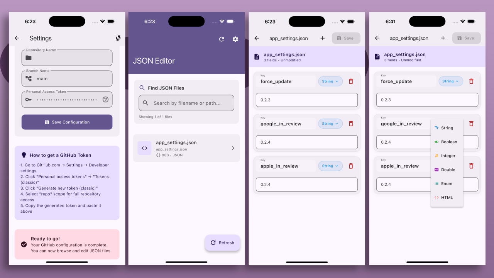

# JSON Editor

A cross-platform JSON editor built with Flutter. This application allows users to browse, edit, and save JSON files directly from a GitHub repository.

## Features

- **GitHub Integration**: Connect to your GitHub repository to fetch and edit JSON files.
- **Cross-Platform Support**: Runs on Windows, macOS, Linux, iOS, Android, and Web.
- **User-Friendly Interface**: Intuitive UI for seamless JSON file management.
- **Search and Filter**: Quickly find files using the search functionality.
- **Offline Support**: Edit files locally and sync changes when online.

## Screenshots



## Getting Started

### Prerequisites

- [Flutter SDK](https://docs.flutter.dev/get-started/install) installed on your machine.
- A GitHub personal access token with the required permissions:
  - `repo` (Full control of private repositories)
  - `public_repo` (Access public repositories)
  - `repo:status` (Access commit status)

### Installation

1. Clone the repository:
   ```bash
   git clone https://github.com/bilalelsayed97/github_json_editor.git
   cd github_json_editor
